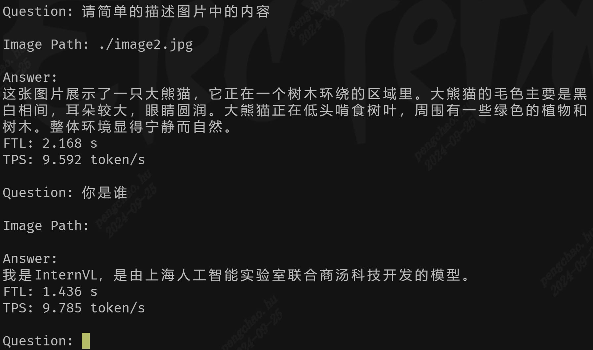

# InternVL2

本工程实现BM1688部署多模态大模型[InternVL2-4B](https://huggingface.co/OpenGVLab/InternVL2-4B)。通过[TPU-MLIR](https://github.com/sophgo/tpu-mlir)编译器将模型转换成bmodel，并采用c++代码将其部署到BM1684X的PCIE环境，或者SoC环境。

## 开发环境准备

#### 1. 下载docker，启动容器

``` shell
docker pull sophgo/tpuc_dev:latest

# myname1234 is just an example, you can set your own name
docker run --privileged --name myname1234 -v $PWD:/workspace -it sophgo/tpuc_dev:latest bash

docker exec -it myname1234 bash
```
后文假定环境都在docker的`/workspace`目录。

#### 2. 从Huggingface下载`InternVL2-4B`

(比较大，会花费较长时间)

``` shell
git lfs install
git clone git@hf.co:OpenGVLab/InternVL2-4B
```

另外需要做一些模型源码上的修改：
将`compile/files/InternVL2-4B/`下的文件替换`InternVL2-4B`中对应的文件。

#### 3. 下载`TPU-MLIR`代码并编译

(也可以直接下载编译好的release包解压)

``` shell
cd /workspace
git clone git@github.com:sophgo/tpu-mlir.git
cd tpu-mlir
source ./envsetup.sh  #激活环境变量
./build.sh #编译mlir
```

## 编译模型

1. 导出所有onnx模型，如果过程中提示缺少某些组件，直接`pip3 install 组件`即可

``` shell
# 安装组件
pip3 install transformers_stream_generator einops tiktoken accelerate
pip3 install git+https://github.com/huggingface/transformers

# 导出onnx
python3 export_onnx.py --model_path your_internvl2_path
```

2. 对ONNX模型进行编译，生成模型`internvl2-4b_bm1688_int4_2core.bmodel`

``` shell
./compile.sh --name internvl2-4b --num_core 2
```

也可以省去编译模型这一步，直接下载编译好的模型：
``` shell
python3 -m dfss --url=open@sophgo.com:/ext_model_information/LLM/LLM-TPU_Lite/internvl2-4b_bm1688_int4_2core.bmodel
```

## 编译与运行程序

* 环境准备
> （python demo运行之前都需要执行这个）
```
sudo apt-get update
sudo apt-get install pybind11
pip3 install sentencepiece transformers==4.37.2
```

编译库文件，生成`chat.cpython*.so`文件，将该文件拷贝到`pipeline.py`文件目录
```
mkdir build
cd build && cmake .. && make && cp *cpython* .. && cd ..
```

* python demo

```
python3 pipeline.py --model_path internvl2-4b_bm1688_int4_2core.bmodel --tokenizer ../support/token_config
```
model为实际的model储存路径；tokenizer_path为实际的tokenizer配置的储存路径

* 运行效果

